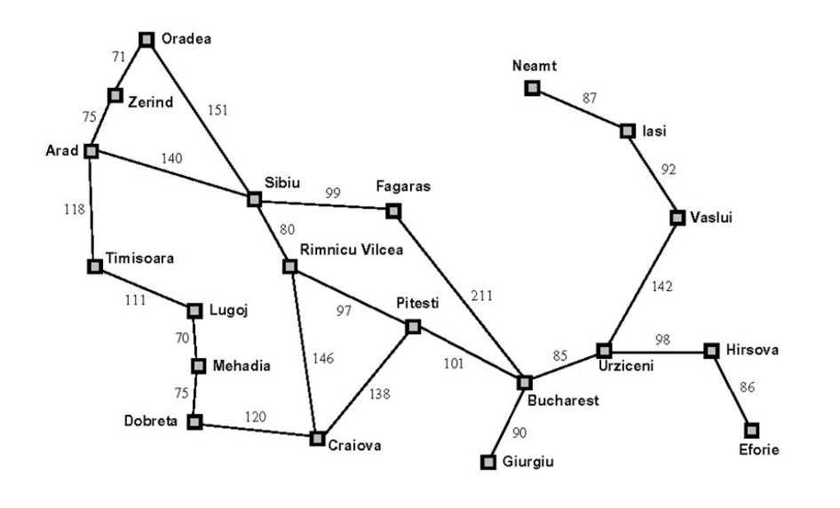

# PRACTICA 1 DE FSI

## Cosas que hay que hacer:
Mirar la pagina web para la practica, en la cual hay dos pdfs con las tareas que hay que realizar "https://cayetanoguerra.github.io/ia/"

### Tareas
#### Primera parte
    •A partir del código base entregado, se deberá programar el método de ramificación y acotación. Utilícese como problema el grafo de las ciudades de Rumanía presente en el código.
    • Comparar la cantidad de nodos expandidos por este método con relación a los métodos de búsqueda primero en anchura y primero en profundidad.
    • Realizar a mano la traza de una búsqueda (opcional).

    